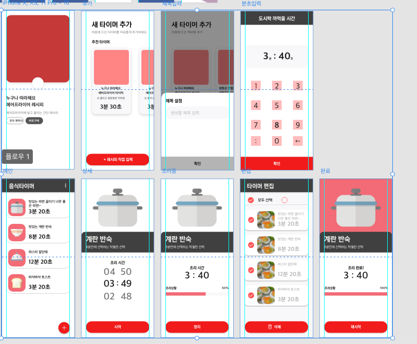

## Food Timer

## Simple Timer Application

Designed by myself, toyproject to learn application design.
Develop by kotlin, tried to maintain clean architecture.
First trial to write test code in every business logic.

## Current Design

## Status

Launched : https://play.google.com/store/apps/details?id=com.sesang06.foodtimer

